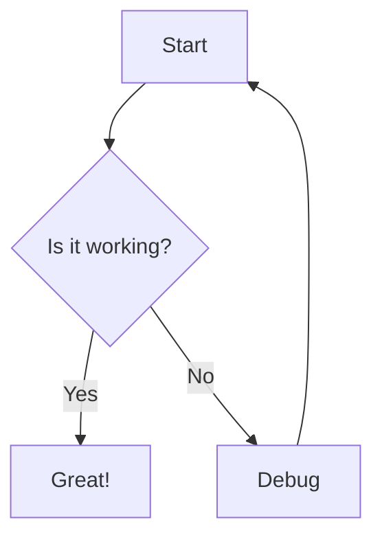

# md2html-self

> Convert Markdown files into **beautiful, self-contained HTML documents** — with Mermaid diagrams pre-rendered to inline SVG, syntax highlighting, sidebar TOC, and dark/light themes.

**Zero runtime dependencies in the output.** One `.html` file you can email, host, or open anywhere.

---

## ✨ Features

- 📊 **Mermaid diagrams** → pre-rendered to inline SVG (no external JS needed)
- 🎨 **Dark & Light themes** — gorgeous, GitHub-inspired styling
- 📑 **Sidebar Table of Contents** — auto-generated from headings, smooth scrolling
- 📝 **GFM support** — tables, blockquotes, task lists, fenced code blocks
- 🖨️ **Print-friendly** — clean print styles included
- 📱 **Responsive** — looks great on mobile
- 📦 **Self-contained** — single HTML file, zero external dependencies
- ⬆️ **Scroll-to-top** button

## 📦 Installation

```bash
# Global install
npm install -g md2html-self

# Or use directly with npx (no install needed)
npx md2html-self README.md
```

## 🚀 Usage

### CLI

```bash
# Basic — creates README.html in the same directory
md2html README.md

# Custom output file
md2html docs/ARCHITECTURE.md -o build/architecture.html

# Light theme
md2html README.md --theme light

# Custom title, no table of contents
md2html notes.md --title "Meeting Notes" --no-toc
```

### Options

| Option | Alias | Description | Default |
|--------|-------|-------------|---------|
| `<input.md>` | | Markdown file to convert | *(required)* |
| `--output <file>` | `-o` | Output HTML file path | `<input>.html` |
| `--title <title>` | `-t` | HTML document title | Filename |
| `--theme <name>` | | Color theme (`dark`, `light`) | `dark` |
| `--no-toc` | | Disable sidebar table of contents | |
| `--help` | `-h` | Show help message | |
| `--version` | `-v` | Show version number | |

### Programmatic API

```javascript
import { convert } from 'md2html-self';

const markdown = '# Hello World\n\nSome **bold** text.';

const html = await convert(markdown, {
  title: 'My Document',
  theme: 'dark',      // 'dark' | 'light'
  toc: true,           // sidebar table of contents
});

// html is a complete, self-contained HTML string
```

## 📊 Mermaid Support

Just use standard fenced code blocks with `mermaid` language — they'll be pre-rendered to inline SVG during conversion:

````markdown

````

The diagrams are rendered using Puppeteer with a headless browser, so they work exactly like they would on GitHub or in Mermaid's live editor.

## 🎨 Themes

### Dark (default)
GitHub-inspired dark theme with vibrant accents - perfect for technical documentation.

### Light
Clean, bright theme with GitHub's light color palette.

## 📋 Requirements

- **Node.js** ≥ 18.0.0
- **Puppeteer** is used under the hood to pre-render Mermaid diagrams. It will download Chromium automatically on first run.

## 🤝 Contributing

Contributions are welcome! Please feel free to submit a Pull Request.

1. Fork the repository
2. Create your feature branch (`git checkout -b feature/amazing-feature`)
3. Commit your changes (`git commit -m 'Add amazing feature'`)
4. Push to the branch (`git push origin feature/amazing-feature`)
5. Open a Pull Request

## 📄 License

[MIT](LICENSE)
